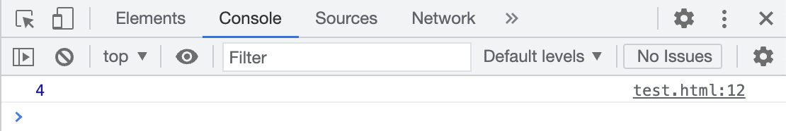

# Introduction

This first part introduces the most basic WASM module in textual format (**.wat**) and several insights in the generated bytecode file (**.wasm**). Then a more elaborated wasm program with a **simple computation** is shown. This computation will be the square of a given natural number. And to conclude, two different options are explored for being capable of **executing** the compiled wasm programs. One of these is execution over the **Node** runtime and the other inside the **browser** via **Javascript interoperability**.

**File:** empty_module.wat

```wasm
;; The most basic module possible to be created in webassembly textual format.
(module)

;; This code needs to be compile to bytecode. Not currently understandable by any runtime.
;; Text (.wat) -> Bytecode (.wasm). This is provided by wabt toolkit.
;; wabt includes compilers to convert between WebAssembly’s text representation and wasm (wat2wasm),
;; and vice versa, plus more besides.
;; Location (github): https://github.com/webassembly/wabt
;; Location (homebrew): https://formulae.brew.sh/formula/wabt#default

```

**Compile** the **textual** representation of a webassembly program to **bytecode** via **wat2wasm** compiler. 

_e.g:_ 

**Compiler flags**:

- `-o output_filename` : Specifies the target generated file.

```bash
$ wat2wasm empty_module.wat -o empty_module.wasm
```

Inspect the contents of the wasm file to see what it looks like. **UNIX** command -> **xxd**

_e.g:_ **empty_module.wasm**

```bash
$ xxd empty_module.wasm
00000000: 0061 736d 0100 0000        00000000: 0061 736d 0100 0000                      .asm....
```

For **fine grained bytecode** representation of the generated output file, specify the flag for verbose compilation. **Opcodes** underneath. will be shown.

**Compiler flags**:

- `-v`

_e.g:_ **empty_module.wasm**

```bash
$ wat2wasm empty_module.wat -v -o empty_module.wasm
0000000: 0061 736d                                 ; WASM_BINARY_MAGIC
0000004: 0100 0000                                 ; WASM_BINARY_VERSION
```
**NOTE:** The previously opcodes shown as examples are universally present in every wasm file as main headers.


# A webassembly module with a simple computation

**Name:** math.wat
**Description:** Take a number a compute its square. Then call it from the browser and exectue it.

```
(module
    ;; The string after the $ symbol specifies the name of the function.
    ;; Given a number compute its square.
    ;; Input
    ;;  param i32
    ;;
    ;; Output
    ;;  result i32
    (func $square (param i32) (result i32)
        local.get 0 ;; pull the input value and push it to the stack
        local.get 0 ;; square function needs the same number twice
        i32.mul ;; mul operation expects two numbers from the stack
        ;; Evaluation of arithmetic expressions using a stack
        ;;
        ;; (2 * 2)
        ;; would be written as
        ;;
        ;; 2 2 *
        ;; and evaluated like this
        ;;
        ;; Contents of the stack                    Program being evaluated
        ;;
        ;;  [ ]                             |               2 2 *
        ;;  [2]                             |               2 *
        ;;  [2, 2]                          |               *
        ;;  [4]                             |
        ;;
        ;; The return value will be the final content of the stack after the execution.
    )
    ;; export the previous function so javascript can run it.
    (export "square" (func $square))
)
```

Detailed **bytecode** opcodes (math.wasm):

```bash
0000000: 0061 736d                                 ; WASM_BINARY_MAGIC
0000004: 0100 0000                                 ; WASM_BINARY_VERSION
; section "Type" (1)
0000008: 01                                        ; section code
0000009: 00                                        ; section size (guess)
000000a: 01                                        ; num types
; func type 0
000000b: 60                                        ; func
000000c: 01                                        ; num params
000000d: 7f                                        ; i32
000000e: 01                                        ; num results
000000f: 7f                                        ; i32
0000009: 06                                        ; FIXUP section size
; section "Function" (3)
0000010: 03                                        ; section code
0000011: 00                                        ; section size (guess)
0000012: 01                                        ; num functions
0000013: 00                                        ; function 0 signature index
0000011: 02                                        ; FIXUP section size
; section "Export" (7)
0000014: 07                                        ; section code
0000015: 00                                        ; section size (guess)
0000016: 01                                        ; num exports
0000017: 06                                        ; string length
0000018: 7371 7561 7265                           square  ; export name
000001e: 00                                        ; export kind
000001f: 00                                        ; export func index
0000015: 0a                                        ; FIXUP section size
; section "Code" (10)
0000020: 0a                                        ; section code
0000021: 00                                        ; section size (guess)
0000022: 01                                        ; num functions
; function body 0
0000023: 00                                        ; func body size (guess)
0000024: 00                                        ; local decl count
0000025: 20                                        ; local.get
0000026: 00                                        ; local index
0000027: 20                                        ; local.get
0000028: 00                                        ; local index
0000029: 6c                                        ; i32.mul
000002a: 0b                                        ; end
0000023: 07                                        ; FIXUP func body size
0000021: 09                                        ; FIXUP section size
antonio@Antonios-imac playground %
```


# Execution procedures

## Node runtime

1. **npm init**
2. Package.json
```json
...
"type": "moudle"
...
```

3. Execute the file **index.js**
_e.g:_ square(10)
```bash
$ node index.js
100
```

## Inside the browser

1. Create an **Express.js** server.
2. Create and instatiate the appropiated server process in a file named **server.js**.
3. Create a **public** folder and **move** _math.wasm_ to its location.
```bash
$ mv math.wasm ./public
```

4. Execution of the server program.
```bash
$ node server.js
Server listening on port: 3000
```

5. Create a standar HTML document and call the appropiate WASM module there.

   5.1 Inside the browser go to: **localhost:3000/test.html**

   5.2 Open the **developer tools**.

   5.3 The output will be in the **console**



